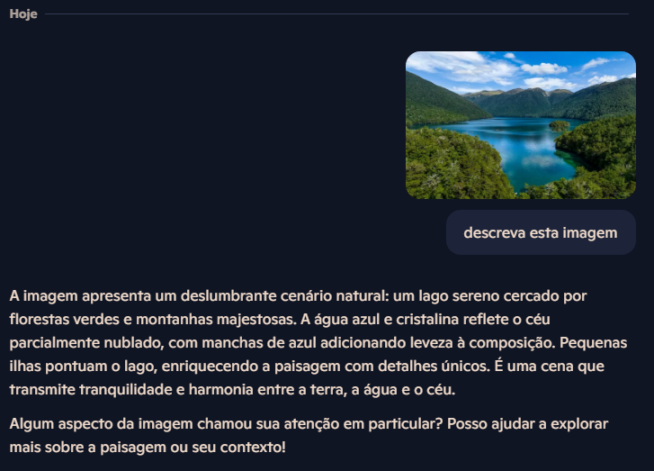

# Projeto de Reconhecimento de Texto em Imagens

## 🧠 Objetivo

Este projeto tem como foco aplicar técnicas de **OCR (Reconhecimento Óptico de Caracteres)** em imagens para extrair textos automaticamente. As imagens escolhidas foram de um **lago** e de uma **praia**, contendo elementos visuais e textuais para teste utilizando o Microsoft Copilot. 

---

## 🗂️ Estrutura do Projeto

```
📂 inputs
   ├── lago.jpg
   └── praia.jpg
📂 output
   ├── texto_lago.txt
   └── texto_praia.txt
📄 README.md
```

---

## 🖼️ Imagens Utilizadas

As imagens utilizadas estão disponíveis na pasta `inputs/`:
- `lago.jpg`: Foto de um lago com possíveis textos em placas ou objetos.
- `praia.jpg`: Foto de uma praia, contendo palavras em elementos da paisagem.

---

## 🧪 Processo de Reconhecimento

1. As imagens foram carregadas na ferramenta de OCR (pode ser Tesseract, Azure OCR, Google Vision, etc.).
2. O texto detectado foi salvo em arquivos `.txt`, localizados na pasta `output/`.
3. A qualidade do reconhecimento pode variar com base na nitidez, contraste e presença de ruídos nas imagens.

---

## 🔍 Insights Obtidos

- O OCR é sensível à **qualidade da imagem** e à **fonte dos textos**.
- Textos em superfícies curvas ou com iluminação irregular apresentam mais dificuldade de reconhecimento.
- O OCR pode ser um ótimo aliado em **digitalização de documentos**, **extração de dados em imagens de produtos** e **acessibilidade**.

---

## Print exemplo:


---

## 🚀 Possibilidades de Aplicação

- Leitura automática de placas ou sinalizações em imagens.
- Extração de dados de documentos escaneados (PDF, fotos, etc.).
- Organização e indexação de imagens com base no texto encontrado.
- Sistemas de busca visual com suporte a texto embutido.

---

Projeto criado com foco educacional para prática de reconhecimento de texto em imagens com IA.

